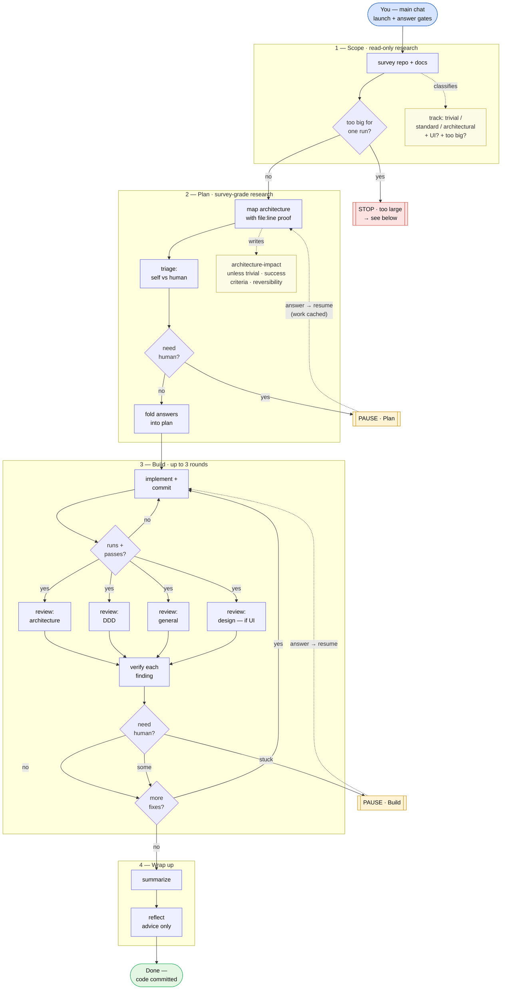
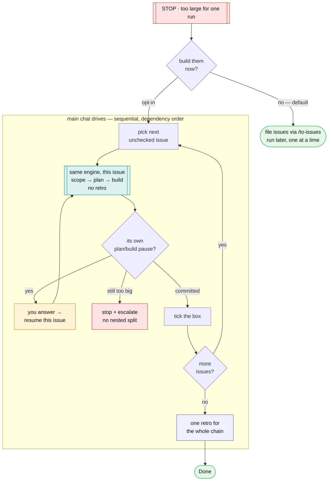

# loop-full-swe — flow diagram

Human-facing reference for the [`loop-swe.js`](loop-swe.js) engine. Not loaded by
the agent (the skill loader only reads [`SKILL.md`](SKILL.md)); kept here so the
diagram never costs run-time context.

**Context management is the whole point.** Each shaded box is a separate
**sub-agent** with its own fresh context window — it does one job and returns a
short structured result. Your main chat never sees a sub-agent's internal work,
only its compact result and the gate summaries. Diamonds are cheap script
branches (no context cost); pale notes are what a phase decides or produces.

Legend: blue = your main chat · indigo = a sub-agent (isolated context) ·
diamond = a script branch · pale note = a decision/output · amber = resumable
pause · red = terminal stop · green = end state.

## Where the research happens

There is no separate "Research" box — research **is** the Scope + Plan phases
(that pairing is exactly what `/loop-research-plan` runs on its own). The early
flow is where the architecture impact gets weighed, and it drives everything
after it:

- **Scope** is a read-only survey of the repo and docs. It classifies the work
  into a **track** by architectural impact — `trivial` (a few files, no
  architectural reach), `standard`, or `architectural` (cross-cutting or a new
  boundary) — and flags whether it **touches UI** and whether it's **too big for
  one run**.
- **Plan** is deliberately more cautious than ordinary plan mode: it maps the
  affected architecture with **file:line evidence**, writes an
  **architecture-impact** analysis (skipped only for `trivial`), gives each work
  item **success criteria**, and tags every open question with its
  **reversibility**.
- Those three factors steer the rest of the flow: `architectural` track → the
  deeper architecture analysis; `UI` → the design reviewer joins the Build
  fan-out; `too big` → the run decomposes instead of building (next section).

## Build, briefly

Build is the working loop: implement → check it runs → review from several angles
**in parallel** → verify each finding against the real diff before it can cost a
rebuild → loop the confirmed fixes back in. Capped at three rounds so it can't
spin forever. The parallel review is the clearest context win: four reviewers run
as four isolated sub-agents at once, none polluting the others' or your context.

## The three stops are not the same

- **PAUSE · Plan** and **PAUSE · Build** are *resumable*. The run hits a question
  it can't answer, returns it to you, and waits. You answer; it resumes the
  **same run** from where it paused — earlier sub-agent work is cached and replays
  instantly.
- **STOP · too large** is *terminal for that run*, and it behaves differently
  enough to deserve its own picture.

## What "too large" does

The work was really several features, so the engine breaks it into sequenced
issues and the run ends. What happens next is **main-chat orchestration**, not a
resume:

So **"new run per issue" = this whole engine, re-invoked once per issue** — but
with `stopAfter: build`, so each issue does Scope → Plan → Build and skips its own
retro. Key points:

- **Sequential, in dependency order.** No parallel runs, no worktrees — issue N+1
  starts only after issue N's commit lands.
- **Your main chat is the manager.** It launches each issue's run, surfaces and
  resumes that issue's own plan/build pauses, ticks the issue off in a progress
  file, then moves on. It is *opt-in*: by default the issues are just filed via
  `/to-issues` for you to run later.
- **One retro at the end** over the whole chain, not per issue.
- **One-level cap.** If an issue is *still* too big, the chain stops and escalates
  to you rather than recursively decomposing.
