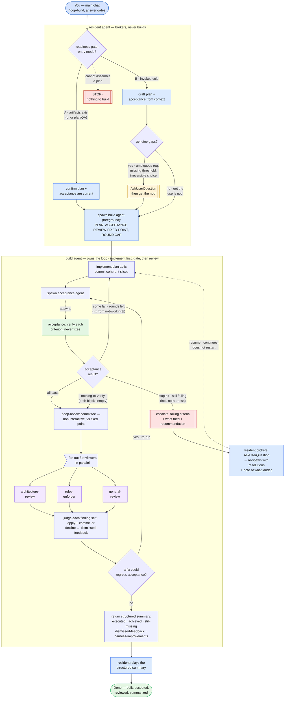

# loop-build — flow diagram

**The resident settles *what ready means*; the build agent owns the loop.** This is
a thin resident-facing entry over two nested agents — it is **not** a segment of the
`loop-swe.js` engine. The resident agent picks the entry mode (artifacts already
exist, or it drafts them cold), confirms the work is ready, and spawns the build
agent foreground. From there the build agent runs the loop on its own behind one
hard rule — **acceptance gates review, always** — and only the few decisions a human
owns come back up: a genuine gap before the build, an escalation at the round cap.
Roles are colored: the resident (blue) brokers and never builds; the build agent
(lavender) implements and orchestrates; the acceptance agent (green) verifies and
never fixes; the three reviewers (purple) run in parallel.

## The two entry modes

The readiness gate is the resident's only real fork. **Mode A** — a prior
research/plan session (e.g. [`/loop-research-plan`](../loop-research-plan/SKILL.md))
already produced the plan and the acceptance doc; the resident confirms both are
current and spawns with **no user interaction**. **Mode B** — invoked cold; the
resident drafts the plan + acceptance from session context, then uses
`AskUserQuestion` **only** for genuine gaps (an ambiguous requirement, a missing
threshold, an irreversible choice) and otherwise gets the user's nod and spawns.
If it cannot assemble a plan at all, it **stops** rather than spawn a build with
nothing to build.

## Acceptance gates review — always

Inside the build agent, the hard rule is the order: **implement → acceptance →
review**, never review first. The acceptance agent verifies each criterion with
evidence and **never fixes** (it spawns nothing). Its result fans into four:

- **all pass** or **nothing-to-verify** (both criteria blocks empty) → proceed to
  review.
- **some fail, rounds left** → fix from the `not-working[]` evidence and loop back
  to implement.
- **cap hit, still failing** (including a `no-harness` criterion with no runnable
  signal) → **escalate**, do not proceed to review.

Only past that gate does the review committee run: `/loop-review-committee`
non-interactively against the review fixed-point, fanning out
**architecture-review**, **rules-enforcer**, and **general-review** in parallel.
The build agent judges each finding itself — applies and commits the ones it
accepts, records the rest with a rationale for `dismissed-feedback` — and if a fix
could regress acceptance, **re-runs acceptance** before returning.

## Escalation is brokered, then resumed

When the build agent stops at the round cap (or hits a blocker it can't act on), it
returns an explicit escalation — the failing criterion, what it tried, its
recommendation. The resident brokers that with `AskUserQuestion` and **re-spawns**
the build agent with the resolutions folded in and a note of what already landed, so
the build **continues rather than restarts**. The resident relays the final
structured summary the build agent returns: `executed`, `achieved`, `still-missing`,
`dismissed-feedback`, `harness-improvements`.
