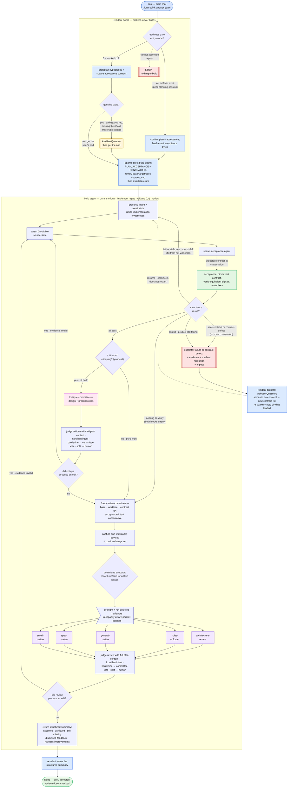

# loop-build — flow diagram

**The resident settles *what ready means*; the build agent owns the loop.** This is
a thin resident-facing entry over two nested agents. The resident agent picks the
entry mode (artifacts already exist, or it drafts them cold), confirms the work
is ready, and awaits one direct build agent through a completion-driven wait.
From there the build agent runs the loop on its own behind one
hard rule — **acceptance gates review, always** — and only the few decisions a human
owns come back up: a genuine gap before the build, a semantic contract defect, or an escalation at
the round cap.
Roles are colored: the resident (blue) brokers and never builds; the build agent
(lavender) implements and orchestrates; the acceptance agent (green) verifies and
never fixes; the build agent acts as the `loop-review-committee` executor and selects up to five
reviewers (purple); and on a UI build the two critics (design + product) run first — right after
acceptance — so the review committee covers their changes too.

```mermaid
flowchart TD
    You([" You — main chat<br/>/loop-build, answer gates "]):::main --> Gate

    subgraph RES ["resident agent — brokers, never builds"]
      direction TB
      Gate{"readiness gate:<br/>entry mode?"}
      Gate -->|"A · artifacts exist<br/>(prior planning session)"| Confirm["confirm plan + acceptance;<br/>hash exact acceptance bytes"]:::resident
      Gate -->|"B · invoked cold"| Draft["draft plan hypotheses +<br/>sparse acceptance contract"]:::resident
      Gate -.->|"cannot assemble<br/>a plan"| NoPlan[["STOP ·<br/>nothing to build"]]:::stop
      Draft --> Gaps{"genuine gaps?"}
      Gaps -->|"yes · ambiguous req,<br/>missing threshold,<br/>irreversible choice"| AskU[["AskUserQuestion<br/>then get the nod"]]:::pause
      Confirm --> Spawn
      AskU --> Spawn
      Gaps -->|"no · get the<br/>user's nod"| Spawn
      Spawn["spawn direct build agent:<br/>PLAN, ACCEPTANCE + CONTRACT ID,<br/>review base/target/spec sources, cap<br/>then await its return"]:::resident
    end

    Spawn --> Impl

    subgraph BUILD ["build agent — owns the loop · implement · gate · critique (UI) · review"]
      direction TB
      Impl["preserve intent + constraints;<br/>refine implementation hypotheses"]:::agent --> Attest["attest Git-visible<br/>source state"]:::agent
      Attest --> Acc
      Acc["spawn acceptance agent"]:::agent
      Acc -.->|"expected contract ID<br/>+ attestation"| AccA["acceptance: bind exact contract,<br/>verify equivalent signals,<br/>never fixes"]:::accept
      AccA --> Split{"acceptance<br/>result?"}
      Split -->|"fail or stale tree · rounds left<br/>(fix from not-working[])"| Impl
      Split -->|"stale contract or contract-defect<br/>(no round consumed)"| Esc
      Split -->|"cap hit · product still failing"| Esc
      Split -->|"all pass"| Crit
      Split -->|"nothing-to-verify<br/>(both blocks empty)"| Review
      Crit{"a UI worth<br/>critiquing? (your call)"}
      Crit -->|"yes · UI build"| Critique["/critique-committee —<br/>design + product critics"]:::critic
      Crit -->|"no · pure logic"| Review
      Critique --> CJudge["judge critique with full plan context ·<br/>fix within intent ·<br/>borderline → committee vote · split → human"]:::agent
      CJudge --> CEdit{"did critique<br/>produce an edit?"}
      CEdit -->|no| Review
      CEdit -->|"yes · evidence invalid"| Attest
      Review["/loop-review-committee —<br/>base + worktree + contract ID;<br/>acceptance/intent authoritative"]:::agent --> Payload
      Payload["capture one immutable payload<br/>+ confirm change set"]:::agent --> Select
      Select{"committee executor:<br/>record run/skip for all five lenses"} --> Fan
      Fan>"preflight + run selected reviewers<br/>in capacity-aware parallel batches"]:::agent
      Fan --> Ra["architecture-<br/>review"]:::review
      Fan --> Re["rules-<br/>enforcer"]:::review
      Fan --> Rg["general-<br/>review"]:::review
      Fan --> Rs["spec-<br/>review"]:::review
      Fan --> Rm["smell-<br/>review"]:::review
      Ra --> Judge
      Re --> Judge
      Rg --> Judge
      Rs --> Judge
      Rm --> Judge
      Judge["judge review with full plan context ·<br/>fix within intent ·<br/>borderline → committee vote · split → human"]:::agent --> Regress{"did review<br/>produce an edit?"}
      Regress -->|"yes · evidence invalid"| Attest
      Regress -->|no| Ret
      Ret["return structured summary:<br/>executed · achieved · still-missing<br/>dismissed-feedback · harness-improvements"]:::agent
    end

    Esc[["escalate: failure or contract defect<br/>+ evidence + smallest resolution<br/>+ impact"]]:::stop --> Broker
    Broker["resident brokers: AskUserQuestion;<br/>semantic amendment → new contract ID;<br/>re-spawn + note of what landed"]:::resident
    Broker -.->|"resume · continues,<br/>does not restart"| Impl

    Ret --> Relay["resident relays the<br/>structured summary"]:::resident
    Relay --> Done([" Done — built, accepted,<br/>reviewed, summarized "]):::done

    classDef main fill:#d6e4ff,stroke:#1f5fbf,color:#111;
    classDef resident fill:#dbeafe,stroke:#2563eb,color:#111;
    classDef agent fill:#eef0ff,stroke:#5b5bd6,color:#111;
    classDef accept fill:#e3f6e3,stroke:#27ae60,color:#111;
    classDef review fill:#f3e8ff,stroke:#8b5cf6,color:#111;
    classDef critic fill:#ffe8f3,stroke:#c026d3,color:#111;
    classDef pause fill:#fff3d6,stroke:#c08a00,color:#111;
    classDef stop fill:#fde2e2,stroke:#c0392b,color:#111;
    classDef done fill:#e3f6e3,stroke:#27ae60,color:#111;
```

## The two entry modes

The readiness gate is the resident's only real fork. **Mode A** — a prior
planning session (e.g. [`/loop-plan-semiauto`](../loop-plan-semiauto/SKILL.md))
already produced the plan and the acceptance doc; the resident confirms both are current, hashes the
exact acceptance bytes, and spawns with **no user interaction**. **Mode B** — invoked cold; the
resident drafts plan hypotheses plus sparse acceptance from session context, then uses
`AskUserQuestion` **only** for genuine gaps (an ambiguous requirement, a missing
threshold, an irreversible choice) and otherwise gets the user's nod and spawns.
If it cannot assemble a plan at all, it **stops** rather than spawn a build with
nothing to build.

## Acceptance gates review — always

Inside the build agent, the hard rule is the order: **implement → attest → acceptance →
critique → review**, never review first. The acceptance agent verifies each criterion
with its named or an equivalent deterministic signal and **never fixes** (it spawns nothing); file
changes add no test scope. It accepts only the expected acceptance contract ID and Git-visible
source-state attestation, checks source state again after verification, and returns both in a completed result. The build
agent cannot report `achieved` from its own checks, from a stale result, or after a later edit. Its
result fans into four:

- **all pass** → critique if there's a UI worth it, then review; **nothing-to-verify**
  (both criteria blocks empty) → straight to review.
- **some fail or the tree is stale, rounds left** → fix from the `not-working[]` evidence and loop back
  to implement.
- **contract defect or stale contract** → escalate immediately without consuming a code-fix round.
- **cap hit, product still failing** → **escalate**, do not proceed to review.

Past that gate, when the build agent judges there's a UI worth critiquing — a passed
visual acceptance criterion is the usual signal, and the source of a known-good launch
path — `/critique-committee` runs the **design** and **product** critics, reaching the UI
via the visual block's env + route/state and the launch command from the build agent's
spawn input; it runs **before** review, so the committee sees the critique-driven changes. From there the build agent **judges every finding itself**, with the full plan and
acceptance in hand: it fixes what improves the increment within the plan's intent,
re-validates after every edit, and puts a
genuinely controversial call — including a product decision the plan didn't make — to a vote
by the three review agents, acting on a unanimous verdict and **escalating only a split** to
the human. The review committee receives the fixed point, `target=worktree`, the sparse acceptance
contract, and the plan whose intent and constraints are authoritative while implementation hypotheses
are context. It captures one immutable payload, records a run/skip
rationale for **architecture**, **documented rules**, **correctness**, **spec conformance**, and
**Fowler smells**; the build agent is the `loop-review-committee` executor for that selection. The
committee requires the immutable payload to contain a spec entry matching the acceptance contract ID,
preflights only the selected agents, runs them in capacity-aware parallel batches, and
invalidates the review if the captured Git-visible change set changes. The build agent judges the separated
findings with the same philosophy and re-runs acceptance and review after every resulting edit.

## Escalation is brokered, then resumed

When the build agent finds a contract defect, it immediately returns the criterion, evidence, smallest
resolution, and impact. The resident gets human confirmation before changing an outcome or source,
rewrites the acceptance doc to its current state, and mints a new contract ID. Ordinary failures still
escalate at the round cap. The resident brokers either case with `AskUserQuestion` and **re-spawns**
the build agent with the resolutions folded in and a note of what already landed, so
the build **continues rather than restarts**. The resident relays the final
structured summary the build agent returns: `executed`, `achieved`, `still-missing`,
`dismissed-feedback`, `harness-improvements`.
