# loop-swe — exact execution logic

A line-faithful walkthrough of [`loop-swe.js`](loop-swe.js), the dynamic-workflow
engine behind the four loop skills. Where [`FLOW.md`](FLOW.md) is the conceptual
picture (and [`ADR.md`](ADR.md) the philosophy), this document is the **literal
control flow**: every input, branch, leaf agent, schema, return value, and file
the script touches — written so you can understand precisely what runs, in what
order, and why, without reading the JavaScript.

A `## Script anchor map` at the end pins every claim here to a line range in the
source, so the two can be cross-checked.

---

## The complete control-flow map

The entire engine on one page. **Coloured boxes are leaf sub-agents** (one job, a
schema-validated result); plain boxes are inline script steps; **diamonds** are
branches the script decides on its own; **PAUSE** nodes are resumable human gates;
**STOP / DONE** nodes are `return`s that end the run. Each numbered section below
walks one slice of this map in detail.

```mermaid
flowchart TD
    Start([launch with args]) --> Setup["SETUP · always:<br/>normalize args<br/>define schemas<br/>resolve root A<br/>build DISC"]
    Setup --> ScopeQ{"plan OR build<br/>will run?"}
    ScopeQ -->|"no · retro-only"| RetroP
    ScopeQ -->|yes| Scope["SCOPE leaf<br/>read-only Explore<br/>track · uiWork<br/>· tooLarge?"]

    Scope --> TooBig{"too large AND<br/>not forceSingle<br/>AND plan runs?"}
    TooBig -->|yes| BD["breakdown leaf<br/>→ issues"]
    BD --> GDist[["STOP · gate<br/>distribute<br/>to issues"]]
    TooBig -->|no| PlanQ{"plan runs?"}

    PlanQ -->|no| BuildQ
    PlanQ -->|yes| Plan["PLAN leaf<br/>writes plan.md<br/>+ arch-impact.md<br/>(unless trivial)"]
    Plan --> PDig["plan-digest leaf<br/>auto-resolve vs<br/>needs-human"]
    PDig --> OpenQ{"open questions<br/>left?"}
    OpenQ -->|yes| GPlan[["PAUSE<br/>gate plan"]]
    OpenQ -->|no| Bake["bake operator<br/>answers → plan.md"]
    Bake --> StopP{"stopAfter<br/>= plan?"}
    StopP -->|yes| GPlanDone[["DONE<br/>gate plan-done"]]
    StopP -->|no| BuildQ{"build runs?"}

    BuildQ -->|no| RetroP
    BuildQ -->|yes| BSetup["pick reviewers<br/>by track<br/>cap 1..3 (budget)<br/>clean round-* dirs"]
    BSetup --> Loop{"rounds left AND<br/>not settled?"}
    Loop -->|no| StopB
    Loop -->|yes| Impl["round++<br/>IMPLEMENT leaf<br/>start-sha · commit<br/>write status.md"]
    Impl --> Val["VALIDATE leaf<br/>/e2e-validate<br/>→ status"]
    Val --> VFail{"validation<br/>failing?"}
    VFail -->|"pass / no-harness"| Review
    VFail -->|"fail · rounds left"| VFeed["feedback<br/>→ plan.md"]
    VFeed --> Loop
    VFail -->|"fail · capped · unanswered"| GBuildV[["PAUSE<br/>gate build<br/>(validation)"]]
    VFail -->|"fail · capped · answered"| VRes["resolve → plan.md<br/>extraRounds++"]
    VRes --> Loop

    Review["REVIEW leaves<br/>(parallel)<br/>trivial: merged<br/>else: arch · ddd<br/>· general<br/>+ design iff uiWork"] --> Anchor["flatten findings<br/>mint stable ids"]
    Anchor --> Verify["VERIFY findings<br/>adversarial<br/>(pipeline)"]
    Verify --> Part["keep confirmed →<br/>auto-apply ·<br/>needs-human"]
    Part --> HumanQ{"needs-human<br/>findings?"}
    HumanQ -->|no| NextQ
    HumanQ -->|yes| RDig["review-digest leaf<br/>reuse finding ids"]
    RDig --> BOpen{"still open<br/>after digest?"}
    BOpen -->|yes| GBuildR[["PAUSE<br/>gate build<br/>(review)"]]
    BOpen -->|no| NextQ
    NextQ{"any fixes<br/>to apply?"}
    NextQ -->|no| Settle["settled = true"]
    Settle --> StopB
    NextQ -->|yes| Inc["incorporate leaf<br/>append fixes<br/>→ plan.md"]
    Inc --> Loop

    StopB{"stopAfter<br/>= build?"}
    StopB -->|yes| GBuildDone[["DONE<br/>gate build-done"]]
    StopB -->|no| RetroP["RETRO phase"]
    RetroP --> Sum["SUMMARY leaf<br/>RUN_DIR/<br/>summary.md"]
    Sum --> Retro["RETRO leaf<br/>reflection.md<br/>+ .patch<br/>never auto-applied"]
    Retro --> GDone[["DONE<br/>gate done"]]

    class Start start;
    class Scope,BD,Plan,PDig,Bake,Impl,Val,VFeed,VRes,Review,Verify,RDig,Inc,Sum,Retro leaf;
    class GPlan,GBuildV,GBuildR pause;
    class GDist stop;
    class GPlanDone,GBuildDone,GDone done;

    classDef start fill:#d6e4ff,stroke:#1f5fbf,color:#111;
    classDef leaf fill:#eef0ff,stroke:#5b5bd6,color:#111;
    classDef pause fill:#fff3d6,stroke:#c08a00,color:#111;
    classDef stop fill:#fde2e2,stroke:#c0392b,color:#111;
    classDef done fill:#e3f6e3,stroke:#27ae60,color:#111;
```



---

## 1. The execution model in one screen

`loop-swe.js` is **not** a normal program that calls functions. It is a
*dynamic-workflow script* — a deterministic orchestrator that the Workflow runtime
executes. It has a small fixed set of runtime-provided powers, and nothing else:

| Power | What it is | Notes |
|---|---|---|
| `agent(prompt, opts)` | Spawn **one** sub-agent ("leaf"), wait, get its result back | With `schema:` the leaf is forced to return a validated JSON object; without it, raw text. A leaf does its one job and does **not** spawn its own sub-agents — fan-out stays in the script by design (nested spawning is supported, just unused here). |
| `parallel([thunks])` | Run several leaves at once, **barrier**: wait for all | A leaf that errors becomes `null` in the result array. |
| `pipeline(items, ...stages)` | Run each item through all stages independently, **no barrier** | Item A can be in stage 2 while item B is still in stage 1. A throwing stage drops that item to `null`. |
| `phase()` / `log()` | Label progress groups / emit a narrator line | Cosmetic — drives the `/workflows` live view only. |
| `return <object>` | **End the run** and hand the object back to the main chat | This is the only exit. Every `return` in the script is either a *resumable pause*, a *terminal stop*, or *done*. |
| `budget.total` / `budget.remaining()` | A runtime-injected object exposing the live token budget for the turn | Read-only; used only to scale the build round cap (§6.2). The cap line reads `budget.total` **unguarded** (`budget.total ? … : 3`), so a falsy `total` (present object, `total` undefined/0) ⇒ cap = 3; a fully-absent `budget` object would throw, not default. |

Two consequences drive the entire design:

1. **All fan-out lives in this script.** Because the engine keeps every agent a leaf
   by design, any "spread this across N workers" logic is lifted up into the
   orchestrator. Every `agent()` call below is a single-job worker.
2. **A `return` is the human break.** The script never blocks waiting for a human.
   When it needs a decision it cannot make, it `return`s a `gate` object and the
   run *ends*. The main chat (the skill that launched the workflow) reads the gate,
   asks you, then **re-launches the same run** with your answers — see
   [§8 Resume](#8-resume--how-a-paused-run-continues).

### What the main chat does around it

The script is one of two "roots". You — the main chat running `/loop-full-swe` —
are the other. The script does all the work and fan-out; you only broker the human
gates *between* runs. The script proceeds entirely on its own until it either
finishes (`gate: 'done'`) or hits something a human must decide.

---

## 2. Inputs (`args`)

The launcher passes an `args` object. The harness may hand it over as a **JSON
string** instead of a parsed object, so the very first thing the script does is
normalize it (`typeof args === 'string' ? JSON.parse(args) : args ?? {}`).

| Arg | Type | Default | Meaning |
|---|---|---|---|
| `feature` | string | `''` | The request text. Required for a fresh run; interpolated into the scope/plan/build prompts. |
| `startFrom` | `'scope'` \| `'plan'` \| `'build'` \| `'retro'` | `'scope'` | First phase to run. |
| `stopAfter` | `'plan'` \| `'build'` \| `'retro'` | `'retro'` | Last phase to run. |
| `resolutions` | `{ [questionId]: answer }` | `{}` | Human answers injected on a gated resume, keyed by the gate question's `id`. |
| `forceSingleRun` | boolean | `false` | Override the "too large → split" bail and run the whole request as one loop. |

### The four skills are just `startFrom`/`stopAfter` presets

`runs(p)` is the gate that decides whether a phase executes: phase `p` runs iff its
position in `ORDER = ['scope','plan','build','retro']` is **between** `startFrom`
and `stopAfter` inclusive. That single predicate is what makes one engine serve
four skills:

| Skill | `startFrom` | `stopAfter` | Phases that run |
|---|---|---|---|
| `/loop-full-swe` | `scope` | `retro` | Scope → Plan → Build → Retro (all) |
| `/loop-research-plan` | `scope` | `plan` | Scope → Plan |
| `/loop-swe-build` | `build` | `retro`* | Build → Retro |
| `/loop-retro` | `retro` | `retro` | Retro only |

\* The chain-builder in SKILL.md launches per-issue runs with `stopAfter: 'build'`
to skip each issue's retro; the stage skill's own default may differ. The engine
honors whatever `startFrom`/`stopAfter` it is given.

`unresolved(qs)` is the companion helper: it filters a question list down to the
ones whose `id` is **not** already present in `resolutions`. It is what makes a
resumed run stop re-asking what you already answered.

---

## 3. Setup that always runs first (before any phase)

These steps execute on **every** invocation, regardless of `startFrom`:

1. **Normalize `args`** and read out `FEATURE`, `START`, `STOP`, `RES`,
   `FORCE_SINGLE`.
2. **Define the schemas.** Ten JSON schemas (`ROOT`, `QUESTION`, `SCOPE`, `PLAN`,
   `DIGEST`, `VALIDATE`, `FINDINGS`, `VERDICT`, `ISSUES`, `SUMMARY`) force every
   structured leaf to return validated JSON — there is **no regex parsing of free
   text** anywhere. Each is detailed where it is used below; §9 lists them all.
3. **Resolve the artifact root `A`** — the single most important piece of setup.
   A leaf (`resolve-root`) computes and creates a per-repo scratch folder and
   returns its absolute path:
   - `HOME` = `$HOME`, or `%USERPROFILE%` on Windows when `$HOME` is unset.
   - `KEY` = the absolute path from `git rev-parse --show-toplevel`, trimmed,
     **lowercased**, with every character outside `[a-z0-9]` replaced by `-`
     (e.g. `D:/Repos/My-App` → `d--repos-my-app`). A deterministic slug, **no
     hashing** — the other loop skills reproduce this exact rule character-for-
     character, so a later `/loop-swe-build` or `/loop-retro` resolves the *same*
     folder.
   - `A` = `<HOME>/.loop-swe/<KEY>`, created with `mkdir -p`.
   - It lives **outside the repo and outside `~/.claude` / `~/.codex`** on purpose:
     run-scratch is not agent config and must never dirty git or need a
     `.gitignore` entry. The script itself cannot touch the filesystem (no
     `Date`/`random`/`git`), which is why one leaf resolves the path once and the
     script threads `A` into every later prompt.
4. **Build the discipline string `DISC`** that is appended to *every* leaf prompt.
   It enforces two rules on each worker:
   - **Leaf-only:** "do your one job and return; you may NOT spawn sub-agents."
   - **Escalation discipline:** before flagging anything as needing a human, check
     in order — `~/.claude/CLAUDE.md`, `<repo>/CLAUDE.md`, `<repo>/CONTEXT.md`,
     `<repo>/docs/adr/`, `<repo>/docs/`, then prior artifacts under `A/`. Escalate
     **only** what those genuinely do not answer. Write artifacts under `A/` only.
5. **Seed defaults.** `scope` defaults to `{ track: 'standard', uiWork: false,
   tooLargeForOneRun: false }` (so a build-only run that skips Scope still has sane
   values), and `plan` starts `null`.

---

## 4. Phase 0 — Scope

**Runs when:** `runs('plan') || runs('build')`. In other words, Scope runs
whenever Plan *or* Build will run, so even a standalone `/loop-swe-build` knows the
`track` and `uiWork` it needs. It is **skipped only for a retro-only run.**

### 4.1 The scope leaf

A single read-only `Explore` agent (`agentType: 'Explore'`) surveys the repo and
project docs and returns a `SCOPE` object:

| Field | Type | Meaning |
|---|---|---|
| `track` | `'trivial'` \| `'standard'` \| `'architectural'` | `trivial` ≈ < 5 files & no architectural impact; `standard`; `architectural` = cross-cutting or a new boundary. Drives review weight later. |
| `uiWork` | boolean | Does the change touch UI? Adds the design reviewer and screenshot validation later. |
| `tooLargeForOneRun` | boolean | **Judged by INDEPENDENCE, not size.** A coherent change spanning many files (a rename/refactor/cleanup) is *not* too large. It is `true` only when the request is genuinely several independent features that each warrant their own issue, plan, and review. File count alone is never the trigger; when in doubt, prefer one run. |
| `rationale` | string | Why. |

The result is `log`ged (`track=… ui=… tooLarge=…`).

### 4.2 The "too large" branch → `distribute-to-issues`

A decomposition bail fires only when **all three** are true:

```
scope.tooLargeForOneRun  AND  NOT forceSingleRun  AND  runs('plan')
```

- `runs('plan')` guard: only a **fresh planning run** may bail. A resumed
  build-only run never decomposes.
- `forceSingleRun` guard: the operator can override the bail and force one loop.

When it fires, a `breakdown` leaf splits `FEATURE` into independent, sequenced
issues (`ISSUES` schema): each issue gets a stable kebab-case `id`, a `title`, a
`body`, and an optional `dependsOn` array of other issue `id`s. Three invariants
are enforced **by the prompt** (the JSON schema can't express them): ids are
unique, every `dependsOn` entry references an id that exists in the set, and the
dependency graph is acyclic (so the chain can be topo-sorted).

The script then **returns** and the run ends:

```
return { gate: 'distribute-to-issues', scope, artifactRoot: A,
         issues: bd.issues, note: 'Feed these to /to-issues, then /loop-full-swe each.' }
```

This is a **recommendation, not a verdict** — the main chat presents three paths
(run as one via `forceSingleRun`, file the issues, or drive the chain now); see
SKILL.md. The engine itself just hands back the breakdown.

---

## 5. Phase 1 — Plan

**Runs when:** `runs('plan')`.

### 5.1 The plan leaf

One `plan` agent produces a **survey-grade** plan (`PLAN` schema) — deliberately
more cautious than ordinary plan mode:

- Maps affected architecture with **file:line evidence**.
- Gives **success criteria per work item**.
- Surfaces **every** genuine open question, each tagged with options, a
  recommendation, and a `reversibility` of `easy` / `moderate` / `hard`.
- **Self-consistency gate:** any help string, usage line, or doc claim the plan
  prescribes about a command's flags/behavior MUST agree with the flags the plan's
  own file:line evidence documents. (A plan that contradicts its own evidence
  guarantees a wasted churn round.)
- **Writes** `A/plan.md`, and — unless `track === 'trivial'` —
  `A/architecture-impact.md`.

`PLAN` returns `items[]` (each with `id`, `summary`, optional `files[]` and
`successCriteria`), `openQuestions[]` (each a `QUESTION`), and a
`touchesPublicSurface` boolean.

### 5.2 The self-digest (the autonomy mechanism)

A `plan-digest` agent triages the plan's `openQuestions` into two buckets
(`DIGEST` schema), given the human answers so far (`RES`):

- **`autoResolved`** — for each question, either it is already answered in `RES`
  (decision = the human's verbatim directive), or the escalation/doc sources answer
  it (decision = that). Each entry carries `id`, `decision`, `why`.
- **`needsHuman`** — only **genuinely unresolved, consequential** questions remain
  here.

### 5.3 The plan gate, and baking operator decisions

```
open = unresolved(digest.needsHuman)          // drop anything already in RES
```

- **If `open.length > 0`** → the run pauses:
  ```
  return { gate: 'plan', scope, plan, artifactRoot: A,
           autoResolved: digest.autoResolved, needsHuman: open,
           note: 'Resolve, then resume; planning is cached.' }
  ```
- **Otherwise** the plan is clear. But operator decisions must reach the plan the
  *build* reads, not merely clear the gate. So the script takes every
  `autoResolved` entry whose `id` is a key in `RES` (`planResolved`) and, if any
  exist, runs a `plan-resolve` leaf to **bake them into `A/plan.md`** as BINDING —
  reflected in full in the affected items and success criteria, not narrowed.
  Note the asymmetry (parallel to §6.4(h)): only RES-keyed resolutions are baked.
  A question the digest auto-resolves from the **docs/escalation sources** clears
  the gate but its `decision` is **NOT** written into the plan — it is dropped.
- Then `log`s `plan clear: N items, M auto-resolved`.

### 5.4 The plan stop

```
if (STOP === 'plan') return { gate: 'plan-done', scope, plan, artifactRoot: A }
```

This is the terminal success for `/loop-research-plan` — plan written, no build.

---

## 6. Phase 2 — Build (implement + multi-perspective review)

**Runs when:** `runs('build')`. This is the engine's core loop. Two state
variables are declared before it so they survive to the retro: `buildOpen = []`
(unresolved review escalations) and `lastVal = null` (the last validation result).

### 6.1 Reviewer panel — sized to the track

The reviewer set is chosen **once**, by track:

- **`trivial`** → a single **merged** reviewer (no skill; guidance string) that
  carries architecture + DDD + general-correctness in one pass, "because a trivial
  change's correctness is mechanically checkable by the e2e-validate that already
  ran." Plus the **design** reviewer (`/design-critique`) **iff `uiWork`**.
- **`standard` / `architectural`** → the full separate panel:
  `architecture` (`/improve-codebase-architecture`), `ddd`
  (`/improve-DDD-architecture`), `general` (no skill), plus **design**
  (`/design-critique`) **iff `uiWork`**.

### 6.2 Round budget (`cap`)

```
cap = budget.total ? clamp(1, 3, floor(budget.remaining() / 150_000)) : 3
```

`budget` is the runtime-injected token-budget global (§1). If the turn has a
token budget (`budget.total` truthy), the round cap scales with remaining tokens
(`budget.remaining() / 150_000`, i.e. 150k per round), clamped to **1–3**. A
falsy `budget.total` ⇒ `cap = 3`. A separate `extraRounds` counter (starts 0) can
extend this — it is incremented only by the validation-failure operator-resolution
path; see §6.4(c) outcome 2.

`cap` is **not persisted**: it is recomputed from `budget.remaining()` on **every**
launch, including a gated resume (§8). A resumed run can therefore have a different
round cap than the original if the remaining token budget differs at resume time,
which changes how many rounds may run after a gate is resolved. Only `round`
progress replays from cache; the `round < cap + extraRounds` bound itself (line
250) is re-evaluated live.

### 6.3 Clean the round dirs once

Before the loop, a `clean-rounds` leaf runs `rm -rf "A"/round-*`. Round dirs are
reused across unrelated runs and accumulate sediment (`*-bak`, abandoned temp
files, stray `node_modules`); wiping once means this run starts from clean dirs.

### 6.4 The round loop

```
while (!settled && round < cap + extraRounds) { round++; phase(`Build r${round}`); … }
```

Each iteration runs the following leaves in order. (`r` below = the current round
number.)

**(a) Implement** — `implement-r{r}` leaf:
- Implements all still-pending items in `A/plan.md` (read from disk).
- Items flagged as **operator decisions are BINDING** — implemented in full, never
  reduced citing minimalism; if one is genuinely infeasible, that is recorded as an
  open question rather than silently delivering less.
- Because `A/round-{r}/` was wiped clean, it must **trust nothing it did not write
  this round** — every current-state fact is re-derived from source at live HEAD,
  never copied forward from a prior artifact.
- Records the pre-change HEAD sha to `A/round-{r}/start-sha`, **commits per logical
  chunk**, and writes `A/round-{r}/status.md` afresh.
- Any step that is not unambiguously executable is recorded (not invented) in
  `A/round-{r}/questions.md`.

**(b) Validate** — `validate-r{r}` leaf (`VALIDATE` schema):
- Invokes `/e2e-validate` (chunk mode) with `ui_work = scope.uiWork`.
- Verifies the code **runs** and meets the plan's success criteria (read from
  `A/plan.md`). When `uiWork` is true it **must screenshot** and confirm each UI
  success-criterion is actually visible — "a UI claim needs pixels."
- Writes specifics to `A/round-{r}/validation.md` and into its returned `detail`.
- Returns `status` ∈ `passing` | `code-errors` | `requirements-unmet` |
  `no-harness`. The result is saved to `lastVal`.

**(c) Validation gate.** Let `valFailing = status === 'code-errors' ||
status === 'requirements-unmet'` (note: `no-harness` and `passing` are **not**
failing — they fall through to review). There are three outcomes:

1. **`valFailing` AND rounds remain** (`round < cap + extraRounds`): a
   `validate-feedback-r{r}` leaf appends the unmet criteria as a pending item to
   `A/plan.md` (so the next round implements against the finding instead of
   re-deriving blind), then `continue` — straight to the next round, **skipping
   review** this round.
2. **`valFailing` AND no rounds remain** (the round budget is exhausted): this is a
   human decision, not a silent ship. **Unlike the plan and review gates, the
   validation-failure gate is NOT self-digested** — there is no
   `autoResolved`/`needsHuman` triage and no escalation-source check. A failing
   validation at the round budget escalates to a human directly via the raw
   `valId in RES` test; the autonomy mechanism only kicks in on resume, when the
   operator answer is folded back via `validate-resolve`.
   - If `r{r}-validation` is **not** in `RES` → pause:
     ```
     return { gate: 'build', scope, round, artifactRoot: A, validation: val,
              needsHuman: [{ id: `r{r}-validation`, question: "e2e-validate still …",
                             recommendation: "inspect A/round-{r}/validation.md",
                             reversibility: 'moderate' }],
              note: 'Validation did not pass within the round budget; resolve then resume.' }
     ```
   - If it **is** in `RES` (the operator already answered on a prior resume) → a
     `validate-resolve-r{r}` leaf appends the operator directive to `A/plan.md` as
     BINDING, **`extraRounds++`** (this is the *only* place the round cap is
     extended), then `continue` to run the granted round.
3. **Not failing** (`passing` or `no-harness`) → fall through to review.

**(d) Multi-perspective review** — `parallel` over the reviewer panel:
- Each reviewer leaf (`review:{key}`, `FINDINGS` schema) reviews the diff since
  `A/round-{r}/start-sha` and returns findings only. The prompt picks its
  instruction in this order: invoke its `skill` via the `Skill` tool if it has
  one; else — for a skill-less reviewer — use its `guidance` string if it has one
  (only the trivial-track `merged` reviewer carries guidance); else fall back to
  the hardcoded literal `'Review the diff directly.'` (the `general` reviewer,
  which has neither skill nor guidance).
- Reviews run **concurrently** (a barrier — all must finish).
- A reviewer leaf that **errors becomes `null`** and contributes no findings (the
  flatten at step (e) reads `r?.findings || []`). There is no retry. If **every**
  reviewer fails in a round, `findings` is empty — **indistinguishable from a
  genuinely clean review** that found nothing. A crashed review panel does not gate
  or retry; see the settle note in §6.4(i).

**(e) Flatten + anchor finding ids:**
```
findings = reviews.flatMap((r, i) =>
  (r?.findings || []).map((f, j) =>
    ({ ...f, reviewer: REVIEWERS[i].key, id: `r{r}-{REVIEWERS[i].key}-{j}` })))
```
Two deliberate details: the flatMap indexes against the **unfiltered** `reviews`
array (so `REVIEWERS[i]` stays aligned even when a reviewer leaf died and returned
`null`), and the **finding `id` is minted here** (a cached step), so a gated
resume matches the same id — the later digest must reuse it verbatim, never
re-mint.

**(f) Adversarial verify** — `pipeline` over `findings`:
- Each finding gets its own `verify:{reviewer}` leaf (`VERDICT` schema) that
  checks it **against the actual diff**, defaulting to skepticism, and returns
  `confirmed` (bool) + `disposition` ∈ `auto-apply` | `auto-skip` | `needs-human`
  + `why`. The verdict is merged onto the finding (`{ ...f, ...v }`).
- Pipeline (no barrier) so each finding is verified as soon as it exists.

**(g) Partition the verified findings:**
```
real     = verified (non-null) where confirmed === true
toApply  = real where disposition === 'auto-apply'
human    = real where disposition === 'needs-human'
```
(`auto-skip` and unconfirmed findings are simply dropped.)

**(h) Digest + gate the human findings.** If `human.length > 0`, a
`review-digest-r{r}` leaf (`DIGEST` schema) triages them exactly like the plan
digest — already answered in `RES` → `autoResolved`; docs/escalation answer →
`autoResolved`; else `needsHuman` — and **must reuse each finding's `id`
verbatim** in both buckets (so a gated resume matches). Then:
- `buildOpen = unresolved(d.needsHuman)`.
- **If `buildOpen.length > 0`** → pause:
  ```
  return { gate: 'build', scope, round, artifactRoot: A, needsHuman: buildOpen,
           autoApplied: toApply.length, note: 'Resolve, then resume; prior rounds are cached.' }
  ```
  (`autoApplied` reports how many auto-apply fixes are *queued* to be incorporated
  when you resume — they are applied on the resumed run, not before the gate.)
- **Otherwise** operator-resolved findings (now in `autoResolved`, filtered to ids
  present in `RES`) are mapped into pending fixes tagged
  `reviewer: 'human-resolution'`, `severity: 'high'` → `resolvedHuman`.

> **Only RES-keyed resolutions become code.** The `resolvedHuman` filter keeps
> only `autoResolved` entries whose `id` is a key in `RES` (a human answer). A
> needs-human finding that the digest auto-resolves from the **docs/escalation
> sources** instead (the second `autoResolved` branch) clears the gate but is
> intentionally **NOT** turned into a pending fix — its `decision` is dropped, so
> it neither gates nor changes code. The same asymmetry holds for plan questions
> (`planResolved` also filters to `RES` ids — §5.3).

**(i) Incorporate or settle:**
```
nextItems = [...toApply, ...resolvedHuman]
if (nextItems.length === 0) { settled = true; break }     // nothing to fix → done looping
```
If there are next items, an `incorporate-r{r}` leaf **appends them as new pending
items to `A/plan.md`** (so the next round implements them); `human-resolution`
items are flagged as operator decisions to implement in full. Then `log` and loop.

> **A crashed review panel settles silently.** `nextItems` derives entirely from
> `findings` (step (e)). When **every** reviewer leaf errored to `null` in this
> round, `findings = []` → `toApply = []` and `human = []` → `resolvedHuman = []` →
> `nextItems = []` → `settled = true`. The loop takes the **same** settle path it
> takes after a genuinely clean review that found nothing. A total
> review-infrastructure failure is therefore **not distinguished** from a real
> no-findings result: it does not gate, retry, or record findings, and the run
> proceeds to the build stop / retro as if the round had been reviewed clean.
>
> **Terminal-round caveat.** Fixes are *applied by the NEXT round's implement
> leaf*, not the round that found them. If confirmed auto-apply or
> operator-resolved fixes are discovered on the last allowed round
> (`round === cap + extraRounds`), `incorporate-r` still appends them to
> `A/plan.md`, but the `while` condition is now false, so the loop exits and they
> are **NOT implemented this run** — they remain as pending items in `A/plan.md`.
> There is no post-loop drain step; a later `/loop-swe-build` over the same artifact
> root would pick them up, and they get no final re-validation this run.
>
> Note: `extraRounds` is incremented **only** by the validation-failure
> operator-resolution path (§6.4c-2), **not** by review escalations. A review
> escalation that you resolve on resume is incorporated into the next round only if
> the original `cap` still has round budget left.

### 6.5 The build stop

```
if (STOP === 'build') return { gate: 'build-done', scope, buildOpen, artifactRoot: A, validation: lastVal }
```

Terminal success for `/loop-swe-build` and for each per-issue run in a decomposition
chain (which launch with `stopAfter: 'build'` to skip per-issue retros).

`buildOpen` is **always `[]` at this return.** Its only assignment is
`buildOpen = unresolved(d.needsHuman)` inside the review digest (§6.4(h)), and a
non-empty value there immediately returns the `gate: 'build'` review pause — so
a build that terminates normally always reaches here with `buildOpen === []`.
The field is included for shape consistency, not because it can surface
escalations here.

---

## 7. Phase 3 — Retro (summary + reflection)

**Runs when:** the script reaches it — i.e. `stopAfter` is `retro` and no earlier
gate returned. There is no separate `runs('retro')` guard here; the earlier
`STOP === 'plan'` / `STOP === 'build'` returns are what stop a shorter run before
this point.

### 7.1 Summary leaf (`SUMMARY` schema)

- Resolves a **per-run** folder `RUN_DIR = A/runs/<id>`, where `<id>` is
  `git rev-parse --short HEAD`, suffixed `-2`, `-3`, … on collision so successive
  runs at the same HEAD don't overwrite each other.
- Writes the summary against **live HEAD**, not the last round it remembers.
- Uses an authoritative **run floor**: this run's first commit is the child of the
  sha stored in `A/round-1/start-sha` (read from disk — the build's `implement-r1`
  leaf wrote it when round 1 began). Commits at or before that floor belong to
  *earlier* runs and must not be folded in. It re-reads `git rev-parse HEAD` and
  `git log <round-1 start-sha>..HEAD`; the commit list must end at live HEAD and the
  run id is that final short sha.
  - **Caveat — build-skipped runs.** `clean-rounds` and the `start-sha` write both
    live inside the build guard (`if (runs('build'))`), so for a standalone
    `/loop-retro` (or any run that skips Build) `round-1/start-sha` was written by
    an **earlier invocation's** build, not this one. The summary's floor and
    commit-range therefore reflect the most recent build, not "round 1 of this
    invocation." On a repo with no prior build the file is **absent**, and the
    floor has to be derived another way.
- Recomputes the "flagged / not actioned" list against the **final** diff (an item
  flagged out-of-scope early may have been actioned later).
- Creates `RUN_DIR` and writes `RUN_DIR/summary.md`: request, track, what was
  built, rounds taken, findings breakdown, status, and the list of decisions
  **auto-resolved without the human** (so they can be audited).
- If `lastVal` exists and was non-passing (e.g. `no-harness`), a `valNote` instructs
  the summary to state that prominently — the change may have shipped without full
  validation.
- Returns `{ markdown, runDir }`.

### 7.2 Retro leaf

- Mines the run for stalls, repeated failures, avoidable escalations, token waste,
  and what worked.
- Writes `RUN_DIR/reflection.md` and `RUN_DIR/reflection.patch` (proposals for
  `CLAUDE.md` / the skills / docs) into the *same* folder the summary leaf returned.
  **It does NOT apply the patch** — proposals are review-only.
- **Carries forward** unapplied prior proposals so an ignored fix can't silently
  keep recurring: it scans sibling `A/runs/*/reflection.patch` files from earlier
  runs, re-checks each proposal against **live source**, and re-emits any that have
  not landed under an `UNAPPLIED FROM PRIOR RUNS` banner with a recurrence count and
  re-verified line anchors; landed ones are dropped. Proposals are matched by a
  stable id, not bare anchor text, so a reworded fix isn't re-counted.

### 7.3 Done

```
return { gate: 'done', scope, artifactRoot: A, validation: lastVal,
         summaryMarkdown: summary.markdown,
         note: `Code committed; per-run reflection.patch under A/runs/ … left for review.` }
```

---

## 8. Resume — how a paused run continues

When the script `return`s a `gate` that is a *pause* (`plan` or `build`), the run
has ended. The main chat:

1. Reads the `needsHuman` items (each has `question`, optional `options`,
   `recommendation`, `reversibility`).
2. Asks you, collects answers into a `resolutions` map keyed by each item's `id`.
3. **Re-launches the SAME run** via `resumeFromRunId` + `args.resolutions`.

On the resumed run, the Workflow runtime **replays every prior `agent()` call from
cache instantly** (same prompt + opts → cached result), so the script races back to
exactly where it paused — but now:

- `RES` contains your answers, so `unresolved(...)` drops the questions you
  answered.
- The relevant digest (plan or review) re-runs and now places those questions in
  `autoResolved` instead of `needsHuman`, so the gate **passes**.
- The operator-resolved decisions are baked into `plan.md` (`plan-resolve`) or
  folded into the next round's pending items (`resolvedHuman` → `incorporate`), so
  your answer actually changes the work, not just the gate.

This is why **finding/question ids are minted at a cached step and reused
verbatim**: the id you answered against must still exist, byte-for-byte, on the
replay — otherwise the answer wouldn't match.

### Gate catalogue

| `gate` | Kind | When | Key fields |
|---|---|---|---|
| `distribute-to-issues` | terminal (recommendation) | Scope judged the request several independent features (and not `forceSingleRun`, and a fresh plan run) | `issues[]`, `scope`, `artifactRoot` |
| `plan` | resumable pause | Plan digest left genuinely-open questions | `plan`, `autoResolved`, `needsHuman`, `artifactRoot` |
| `plan-done` | terminal success | `stopAfter === 'plan'`, plan clear | `plan`, `scope`, `artifactRoot` |
| `build` (validation) | resumable pause | e2e-validate still failing at the round budget | `round`, `validation`, `needsHuman`, `artifactRoot` |
| `build` (review) | resumable pause | A review finding needs a human after digest | `round`, `needsHuman`, `autoApplied`, `artifactRoot` |
| `build-done` | terminal success | `stopAfter === 'build'` | `buildOpen` (always `[]` here — see §6.5), `validation`, `scope`, `artifactRoot` |
| `done` | terminal success | Ran clean through retro | `summaryMarkdown`, `validation`, `artifactRoot` |

Both pauses use the same `gate: 'build'` string. **Distinguish them by fields, not
the `gate` string:** the validation pause carries `validation` and a single
`needsHuman` item whose `id` is `r{round}-validation`; the review pause carries
`autoApplied` (and reviewer-minted `needsHuman` ids like `r{round}-{reviewer}-{j}`).
The resume broker must inspect fields, not branch on `gate` alone.

Every gate returns `artifactRoot` so the main chat never recomputes the path.

---

## 9. Schemas at a glance

All structured leaves are forced to emit one of these (validated at the tool layer,
so a leaf retries on mismatch — there is no free-text parsing):

| Schema | Used by | Required fields |
|---|---|---|
| `ROOT` | resolve-root | `root` |
| `SCOPE` | scope | `track`, `uiWork`, `tooLargeForOneRun`, `rationale` |
| `ISSUES` | breakdown | `issues[]` of `{id, title, body, dependsOn?}` |
| `PLAN` | plan | `items[]`, `openQuestions[]` (QUESTIONs), `touchesPublicSurface` |
| `QUESTION` | plan/digests/gates | `id`, `question`, `options?`, `recommendation`, `reversibility` |
| `DIGEST` | plan-digest, review-digest | `autoResolved[]` of `{id, decision, why}`, `needsHuman[]` (QUESTIONs) |
| `VALIDATE` | validate | `status` (`passing`/`code-errors`/`requirements-unmet`/`no-harness`), `detail?` |
| `FINDINGS` | reviewers | `findings[]` of `{title, severity, evidence, fix}` |
| `VERDICT` | verify | `confirmed`, `disposition` (`auto-apply`/`auto-skip`/`needs-human`), `why` |
| `SUMMARY` | summary | `markdown`, `runDir` |

---

## 10. Artifacts written, by phase

Everything lives under the artifact root `A = <HOME>/.loop-swe/<repo-slug>/`,
**outside the repo**.

| Path | Written by | Contents |
|---|---|---|
| `A/` | resolve-root | the root folder itself |
| `A/plan.md` | plan; appended by validate-feedback, validate-resolve, incorporate, plan-resolve | the living plan + pending items folded in across rounds |
| `A/architecture-impact.md` | plan (unless `trivial`) | architecture analysis |
| `A/round-{r}/start-sha` | implement-r | pre-change HEAD sha for round r (the run floor anchor) |
| `A/round-{r}/status.md` | implement-r | what round r did |
| `A/round-{r}/questions.md` | implement-r | steps that weren't unambiguously executable |
| `A/round-{r}/validation.md` | validate-r | e2e-validate specifics / screenshot paths |
| `A/runs/<short-sha>/summary.md` | summary | the human-readable run summary |
| `A/runs/<short-sha>/reflection.md` | retro | observations |
| `A/runs/<short-sha>/reflection.patch` | retro | proposals (never auto-applied) |

---

## 11. Design invariants worth remembering

- **One root, leaf workers.** All fan-out is in the script; no leaf spawns a
  sub-agent. This is a design choice (determinism + resumability), not a runtime
  limit — nested spawning is supported as of Claude Code v2.1.172, just unused here.
- **Autonomous by default; a `return` is the only human break.** The self-digest is
  the gatekeeper — the run pauses only when a question is genuinely unresolved and
  consequential.
- **Escalation discipline before every escalation.** Each leaf checks the project
  docs and prior artifacts before flagging anything for a human.
- **Adversarial verification before any rebuild.** Every review finding is
  independently re-checked against the real diff before it can cost an implement
  round; the verifier defaults to skepticism. *Caveat:* confirmed fixes are applied
  by the **next** round, so fixes found on the last allowed round are appended to
  `A/plan.md` but never implemented or re-validated this run (§6.4i).
  *Caveat:* this gate only fires when reviewers return findings — a round where
  **every** reviewer leaf errored produces no findings and settles exactly like a
  clean review, so a crashed review panel is **not** distinguished from a
  no-findings one (§6.4i).
- **Re-derive from live HEAD, never trust forwarded facts.** Round dirs are wiped;
  the run floor is read from `round-1/start-sha`; the summary recomputes against
  live HEAD — the engine systematically refuses to carry stale file:line claims
  forward.
- **Cached-id stability is what makes resume work.** Ids are minted at cached steps
  and reused verbatim through digests and gates.

---

## Script anchor map

Cross-check every section against the source:

| Section | `loop-swe.js` lines |
|---|---|
| Inputs / `args` doc | 21–27, 36–44 |
| `runs` / `unresolved` helpers | 42–44 |
| Schemas | 45–125 |
| Setup: resolve root `A` | 127–146 |
| Setup: `DISC` discipline string | 148–153 |
| Defaults (`scope`, `plan`) | 155 |
| Phase 0 — Scope leaf | 158–172 |
| Phase 0 — distribute-to-issues bail | 174–184 |
| Phase 1 — plan leaf | 187–200 |
| Phase 1 — plan-digest | 201–207 |
| Phase 1 — plan gate + bake | 208–218 |
| `STOP === 'plan'` return | 220 |
| Phase 2 — REVIEWERS by track | 224–239 |
| Phase 2 — `cap` budget math | 240 |
| Phase 2 — clean-rounds | 242–249 |
| Phase 2 — round loop / implement | 250–263 |
| Phase 2 — validate | 264–271 |
| Phase 2 — validation gate (3 outcomes) | 272–295 |
| Phase 2 — parallel review | 297–302 |
| Phase 2 — anchor finding ids | 303–305 |
| Phase 2 — adversarial verify | 306–311 |
| Phase 2 — partition + review digest gate | 312–332 |
| Phase 2 — incorporate / settle | 333–343 |
| `STOP === 'build'` return | 345 |
| Phase 3 — summary leaf | 347–370 |
| Phase 3 — retro leaf | 371–381 |
| `gate: 'done'` return | 383 |
