# loop-plan — flow diagram

`/loop-plan-manual` and `/loop-plan-semiauto` run one shared 5-phase pipeline — research
fan-out, grill, draft `plan.md` + `acceptance.md`, artifact review, hand off — and differ at
**only Phase 2, the grill**: manual puts every question to the human via `/grill-with-docs`;
semiauto lets a three-lens committee vote via `/grill-with-committee` and pauses only on a
split or an "Other". The spine forks at Phase 2 and re-merges into Phase 3; the diagram
carries the rest.

```mermaid
---
config: { layout: elk }
---
flowchart TD
    You([" You — main chat<br/>/loop-plan-manual &lt;topic&gt;<br/>or /loop-plan-semiauto &lt;topic&gt; "]):::main --> Resident

    Resident["resident agent —<br/>drives all 5 phases itself<br/>(no orchestrator)"]:::resident --> P1in

    subgraph P1 ["Phase 1 — Research (shared)"]
      direction TB
      P1in>"fan out parallel research<br/>sub-agents in ONE message<br/>(codebase + web)"]:::resident
      P1in --> Rcode["codebase agents:<br/>how it works today<br/>at file:line"]:::agent
      P1in --> Rweb["web agents:<br/>prior art, constraints —<br/>focused finding, not a dump"]:::agent
      P1in --> Deep["deep-research skill —<br/>ONLY time-sensitive facts<br/>(lib status, changed API,<br/>version); cite URLs"]:::agent
      Rcode --> Brief
      Rweb --> Brief
      Deep --> Brief
      Brief["synthesise grounded brief:<br/>problem restated, area map<br/>(file:line), constraints/risks,<br/>cited facts, OPEN QUESTIONS"]:::resident
    end

    Brief --> Fork{"Phase 2 — Grill<br/>which skill?<br/>(seed: open questions)"}

    subgraph P2 ["Phase 2 — Grill (the only difference)"]
      direction TB
      Fork -->|manual| ManCheck{"/grill-with-docs<br/>installed?"}
      ManCheck -->|no| ManStop[["STOP — tell the user<br/>grill-with-docs<br/>not installed"]]:::stop
      ManCheck -->|yes| Manual["/grill-with-docs:<br/>put EVERY question<br/>to the human"]:::agent
      Manual --> ManAsk[["every question →<br/>human answers"]]:::pause
      ManAsk -->|"loop until<br/>nothing open"| Manual

      Fork -->|semiauto| SemiCheck{"/grill-with-committee<br/>installed?"}
      SemiCheck -->|no| SemiStop[["STOP — tell the user<br/>grill-with-committee<br/>not installed"]]:::stop
      SemiCheck -->|yes| Semi["/grill-with-committee:<br/>batch questions<br/>with options"]:::agent
      Semi --> Vote["three-lens committee VOTES:<br/>architecture · rules ·<br/>first-principles"]:::review
      Vote -->|"unanimous choice"| Silent["accepted silently"]:::review
      Vote -->|"split or 'Other'"| SemiAsk[["escalate to human"]]:::pause
      Silent -->|"loop until<br/>nothing open"| Semi
      SemiAsk -->|"loop until<br/>nothing open"| Semi
    end

    ManAsk -->|"resolved decisions"| P3draft
    Silent -->|"resolved decisions"| P3draft

    subgraph P3 ["Phase 3 — Draft artifacts (shared, loop-build format)"]
      direction TB
      P3draft["write plan.md —<br/>buildable per-item list:<br/>what + why, in build order,<br/>grounded in file:line map"]:::resident
      P3draft --> P3acc["write acceptance.md in<br/>loop-build's TWO blocks:<br/>Non-visual + Visual —<br/>BOTH headers always present"]:::resident
      P3acc --> P3path["write both to fresh per-run folder:<br/>~/.loop-plan/&lt;repo-key&gt;/&lt;run-key&gt;/<br/>(run-key isolates this run;<br/>overridable if user names one)"]:::resident
    end

    P3path --> P4fan

    subgraph P4 ["Phase 4 — Artifact review (shared, on the artifacts)"]
      direction TB
      P4fan>"spawn THREE review agents<br/>in ONE message —<br/>each handed plan.md +<br/>acceptance.md + brief"]:::resident
      P4fan --> Arch["architecture-<br/>review"]:::review
      P4fan --> Rules["rules-<br/>enforcer"]:::review
      P4fan --> Gen["general-<br/>review"]:::review
      P4fan -.->|"reviewer subagent_type<br/>missing"| P4stop[["STOP — tell the user<br/>which reviewer<br/>is uninstalled"]]:::stop
      Arch --> Judge
      Rules --> Judge
      Gen --> Judge
      Judge["resident judges each finding<br/>ITSELF; apply accepted ones<br/>by REVISING artifacts<br/>(~2 rounds, bounded)"]:::resident
      Judge --> Dismiss[["surface EVERY dismissal<br/>with one-line rationale<br/>to the user"]]:::pause
      Judge -->|"revision could<br/>introduce new issue"| P4fan
    end

    Dismiss --> P5node

    subgraph P5 ["Phase 5 — Hand off (shared, NO auto-handoff)"]
      direction TB
      P5node["STOP. Print exact plan.md +<br/>acceptance.md paths; summarise<br/>dismissed findings (semiauto also:<br/>committee escalations); tell user<br/>to run /loop-build when ready"]:::resident
    end

    P5node --> Done([" Done — plan.md + acceptance.md<br/>ready; /loop-build picks them up<br/>(do NOT auto-launch) "]):::done

    classDef main fill:#d6e4ff,stroke:#1f5fbf,color:#111;
    classDef resident fill:#dbeafe,stroke:#2563eb,color:#111;
    classDef agent fill:#eef0ff,stroke:#5b5bd6,color:#111;
    classDef review fill:#f3e8ff,stroke:#8b5cf6,color:#111;
    classDef pause fill:#fff3d6,stroke:#c08a00,color:#111;
    classDef stop fill:#fde2e2,stroke:#c0392b,color:#111;
    classDef done fill:#e3f6e3,stroke:#27ae60,color:#111;
```

