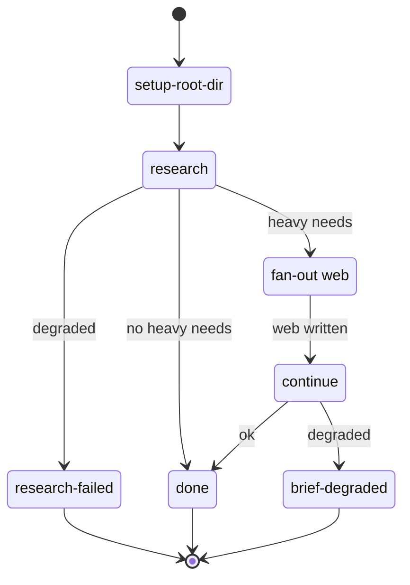
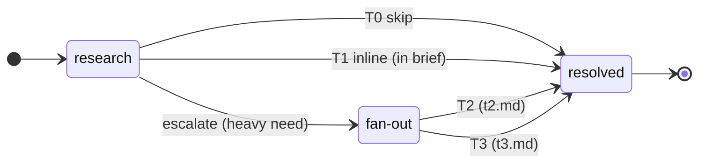
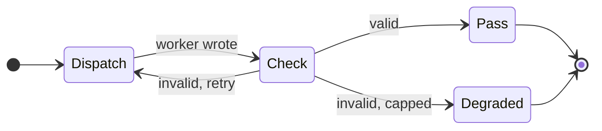

# wf-research — control flow

## Phase pipeline (outer state machine)

## Web tiers (where T0/T1/T2/T3 run)

T0/T1 are decided and executed inside `research` (per fact); only an escalated fact
crosses into the fan-out, which runs only T2/T3.

## enforced() — per-artifact loop (inner state machine)

A crashed worker (returns nothing) retries, or degrades at the cap, the same way — but
skips the Check.

