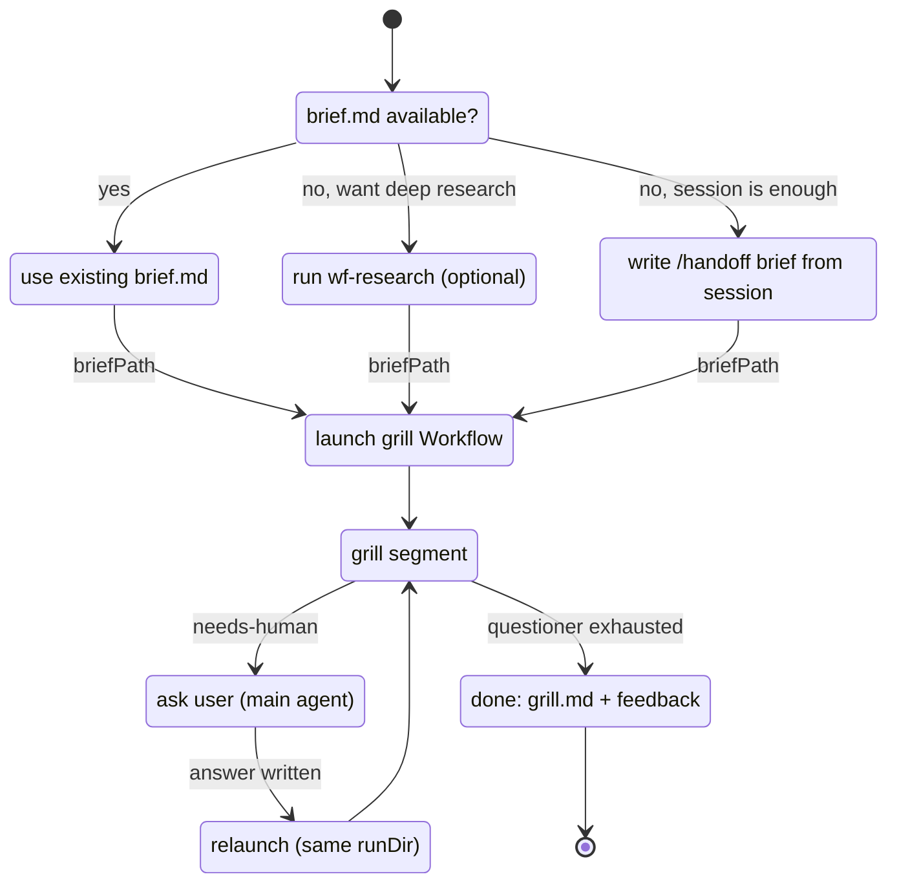
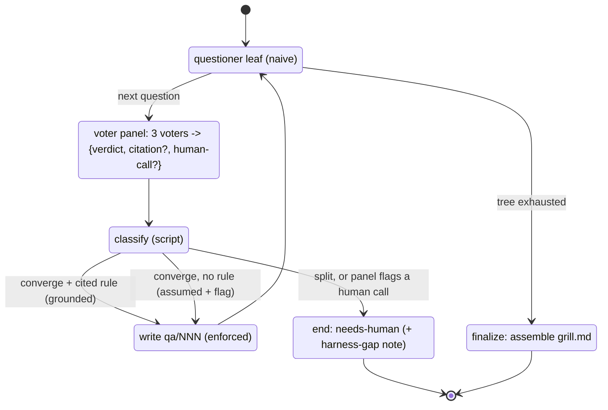
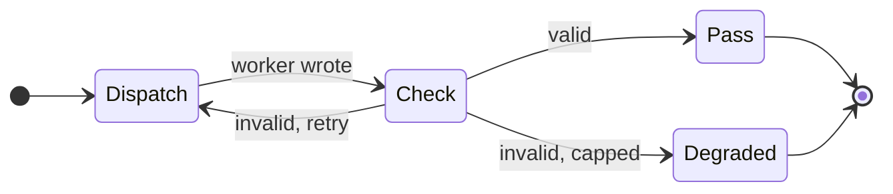

# wf-semiauto-grill — control flow

## Outer pipeline (main agent + Workflow segments)

Before the script runs, the launcher ensures a `brief.md` exists — reuse an existing one,
optionally run `wf-research`, or write a `/handoff` brief from session context. Then it
launches the grill Workflow and relaunches it once per human pause.

Any segment may also end `aborted` (no brief / no run dir) or `degraded` (an artifact write hit
its retry cap); a finished run is `grill-degraded` instead of `done` if the digest write was
capped.

## Grill segment (inside the Workflow script)

One segment auto-resolves a chain of questions and stops at the first genuine decision.

Convergence auto-answers either way — *grounded* (a cited harness rule) or *assumed* (a
conventional default, flagged in the digest and emitted as harness-gap feedback). The human is
pulled in only for a genuine decision: the panel splits, or flags the question as a human call.

## enforced() — per-artifact loop

Reuses the `wf-research` enforcement loop: a worker writes an artifact, a separate checker
leaf reads it back from disk, the script gates pass / re-dispatch / degrade. No later leaf
reads an unverified artifact — here, the checker also enforces that each `qa/NNN` entry
carries enough (question, resolution, cited rule or escalation reason, provenance) for a cold
questioner to continue.

